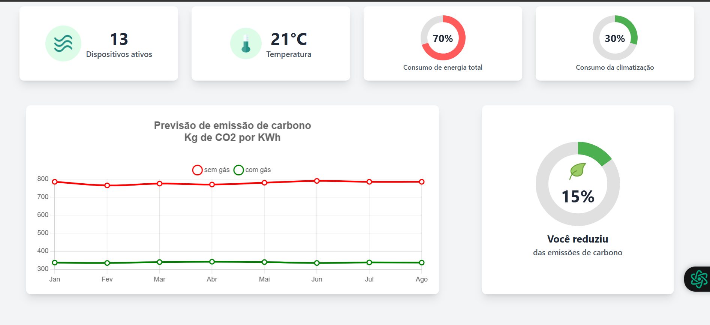

# DeltaCarbon

DeltaCarbon is a React-based dashboard developed to monitor and optimize commercial air conditioner usage. The project was created as part of a hackathon challenge focused on building sustainable and pollution-mitigating solutions.



## How it works

- Displays real-time device activity, temperature, and energy consumption.

- Compares CO₂ emissions with and without gas usage, per kWh.

- Shows monthly forecasts of carbon emissions.

- Calculates and displays carbon emission reduction percentage.

- Helps businesses monitor and reduce their environmental impact through air conditioning control.

## Technologies used

- React (front-end framework)

- TypeScript (type safety)

- Vite (development server and build tool)

- Tailwind CSS (for modern, responsive styling)

- Recharts (for dynamic data visualizations)

## How to run

1. **Clone the repository**:

   ```bash
   git clone https://github.com/021Antonio/DeltaCarbon.git
   ```

2. **Navigate to the project folder:**:

   ```bash
    cd DeltaCarbon
   ```

3. **Install dependencies:**

    ```Node
    npm install
    ```

4. **Run the development server:**
```Node
npm run dev
```

5. **Access the dashboard:**

Open your browser and go to `http://localhost:5173`.


